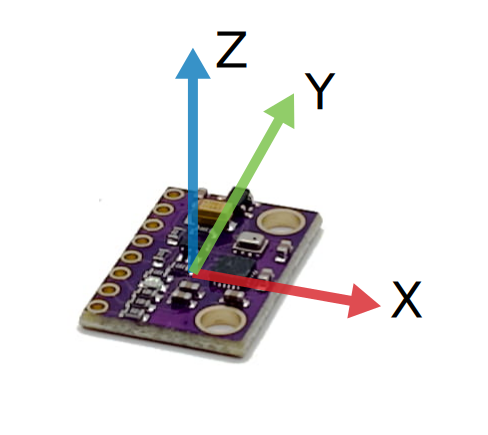
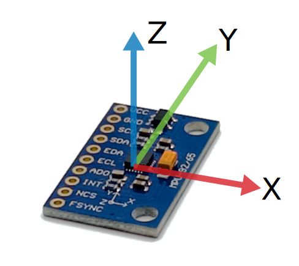
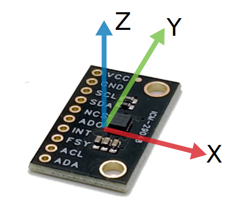

# Arduino drivers for the Flix drone peripherals

This library contains Arduino drivers for the peripherals used in the [Flix drone](https://github.com/okalachev/flix) project.

Based on:

* [Bolder Flight InvenSense-IMU library](https://github.com/bolderflight/invensense-imu). Original author: Brian Taylor (brian.taylor@bolderflight.com).
* [Bolder Flight SBUS library](https://github.com/bolderflight/sbus). Original author: Brian Taylor (brian.taylor@bolderflight.com).
* [ICM20948_WE Arduino library](https://github.com/wollewald/ICM20948_WE/). Original author: Wolfgang Ewald (wolfgang.ewald@wolles-elektronikkiste.de).
* [MPU6050 Arduino Library](https://github.com/ElectronicCats/mpu6050). Author: [ElectronicCats](https://github.com/ElectronicCats).

## IMU

### MPU-9250/MPU-6500

Example for SPI-connected IMU:

```cpp
#include <MPU9250.h>
#include <SPI.h>

MPU9250 IMU(SPI); // no need to specify CS pin, the default pin is used automatically

void setup() {
  IMU.begin();
}

void loop() {
  float gx, gy, gz, ax, ay, az, mx, my, mz;
  IMU.waitForData(); // blockingly read the data, use IMU.read() for non-blocking read
  IMU.getGyro(gx, gy, gz);
  IMU.getAccel(ax, ay, az);
  IMU.getMag(mx, my, mz);
  // Process the data...
}
```

The library will detect IMU type (MPU-9250 or MPU-6500) automatically. You can use the `whoAmI()` method to check the IMU type:

```cpp
if (IMU.whoAmI() == IMU.WHOAMI_MPU6500) {
  // MPU6500 detected
} else {
  // MPU9250 detected
}
```

Notice, that MPU6500 does not include a magnetometer, so magnetometer data will be always zero.

You can also use `<MPU6500.h>` header and `MPU6500` class, which is an alias for `MPU9250` class.

#### I²C

In case of using I²C connection (not recommended), the initialization would look like this:

```cpp
#include <MPU9250.h>
#include <Wire.h>

MPU9250 IMU(Wire); // the default address is used automatically

void setup() {
  Wire.begin();
  Wire.setClock(400000); // 400 kHz I²C clock
  IMU.begin();
}
```

### ICM-20948

The ICM-20948 IMU driver has the same interface. Only the declaration is changed in the example above:

```cpp
#include <ICM20948.h>

ICM20948 IMU(SPI);
```

### IMU axes orientation

Orientation of the IMU axes (including magnetometer) on various boards:

|GY-91|MPU-9265|ICM-20948|GY-521|
|-|-|-|-|
|||||

### Connection

Connecting GY-91 board to ESP32 using VSPI:

* 3V3 → 3V3
* GND → GND
* SCL → IO18
* SDA (MOSI) → IO23
* SAO (MISO) → IO19
* NCS → IO5

Connecting MPU-92.65 board to ESP32 using VSPI:

* VCC → 3V3
* GND → GND
* SCL → IO18
* SDA (MOSI) → IO23
* AD0 (MISO) → IO19
* NCS → IO5

Connecting ICM-20948 board to ESP32 using VSPI:

* VCC → 3V3
* GND → GND
* SCL → IO18
* SDA (MOSI) → IO23
* NCS → IO5
* AD0 (MISO) → IO19

### Logging

By default, the library logs some of the errors to the serial output. On ESP32, the default serial port is determined by the Core Debug Output mechanism, thus can be changed using `setDebugOutput` method:

```cpp
Serial2.setDebugOutput(true); // all the debug output will now be sent to Serial2
```

On platforms other than ESP32, the default output port is *Serial*. On all platforms the debug output can be changed using `setLogOutput` method:

```cpp
IMU.setLogOutput(Serial2);
```

The debug output can be disabled using `setVerbosity` method:

```cpp
IMU.setVerbosity(false); // disable debug output
```

## SBUS

Example for SBUS receiver, connected to Serial2:

```cpp
#include <SBUS.h>

SBUS RC(Serial2, true); // Using Serial2, software inversion enabled

void setup() {
  Serial.begin(115200);
  RC.begin();
}

void loop() {
  if (!RC.read()) return;
  SBUSData data = RC.data();
  for (int i = 0; i < data.NUM_CH; i++) {
    Serial.print(data.ch[i]);
    Serial.print(" ");
  }
}
```

### Connection

Connecting SBUS receiver to ESP32:

* VIN → 3V3
* GND → GND
* SIGNAL → IO16 (RX2)
